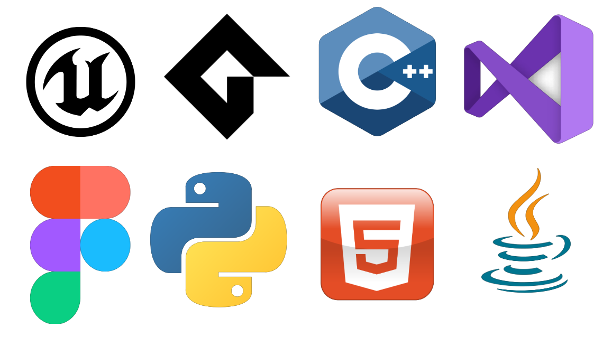
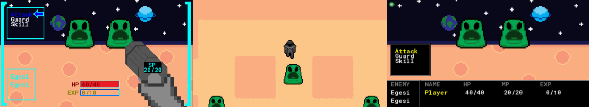

<html>
<head>
<header>Jake Allison Portfolio</header>
<link rel="stylesheet" href="https://raw.githubusercontent.com/JakeA2004/Game-Projects/refs/heads/main/style.css">  
</head>
<body>

Email: jakeallison8@hotmail.co.uk

<a href="https://uk.linkedin.com/in/jake-allison-8a9453297?trk=people-guest_people_search-card">LinkedIn</a>
<h1>Student at Northumbria University</h1>

Experienced in...

<ul>
    <li>Java</li>
    <li>Unreal Engine 5 Blueprint Scripting </li>
    <li>C++</li>
    <li>GameMaker Language (GML)</li>
    <li>HTML and Web Programming</li>
    <li>Python</li>
</ul>

<h1>Game Projects</h1>

Below are the past projects I have worked on.

<h2> Locked Course</h2>

A puzzle-action game set in an alien spaceship. The player explores abandoned facilities, collecting weapons like the grappling hook and portal gun in order to find a way home. I took the role of Lead Designer for gameplay, levels and user interface. Developed for Team Project and Professionalism module, collaborating with 5 other students. Engine Used: Unreal Engine 5 

<h2> Mariana Wrench</h2>

A survival-crafting game in which the player is stranded within a dome at the bottom of the sea. They must venture outside the dome and salvage materials and catch fish for food. Materials gathered can be used to extend the oxygen tank, build houses within the bubble or even expand the radius of the dome. As upgrades are acquired, they are capable of venturing even further and discovering more of the world. I created the initial concept, player character and developed the user interface. Created as part of Global Game Jam 2025 in collaboration with 3 other students. Engine Used: Unreal Engine 5

<h2> Tomb of Dread</h2>

A dungeon crawler in which the player must collect three keys within a randomly generated dungeon. The player fights enemies and collects power-ups to increase their health, stamina, attack power and defence. Developed for the Software Engineering Practice module in collaboration with 3 other students. Engine Used: Unreal Engine 5

<h2> Die, Egesis!</h2>

A Turn-based RPG created to experiment with diegetic and non-diegetic interfaces. You play as a space explorer and must defeat the Egesi aliens, gain experience points to level up and eventually defeat the boss, the Egesi Queen. With Diegesis turned on, several HUD elements are altered like ammo being displayed on the back of your gun and helmet holograms displaying player information. Created for final year project. Engine Used: GameMaker

</body>
</html>

