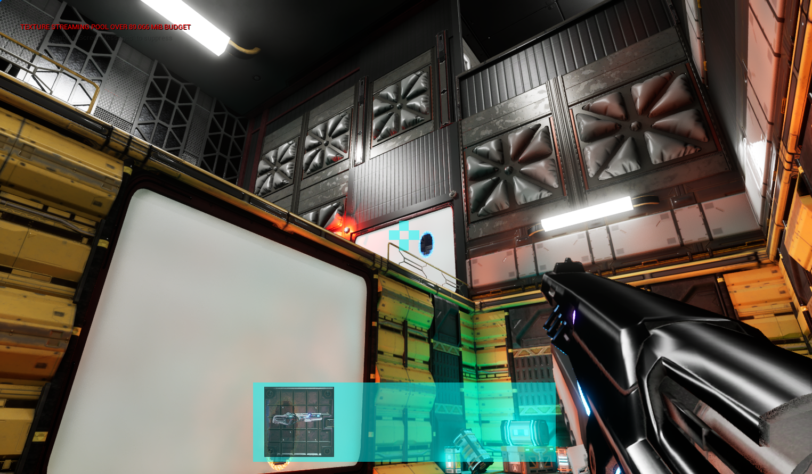
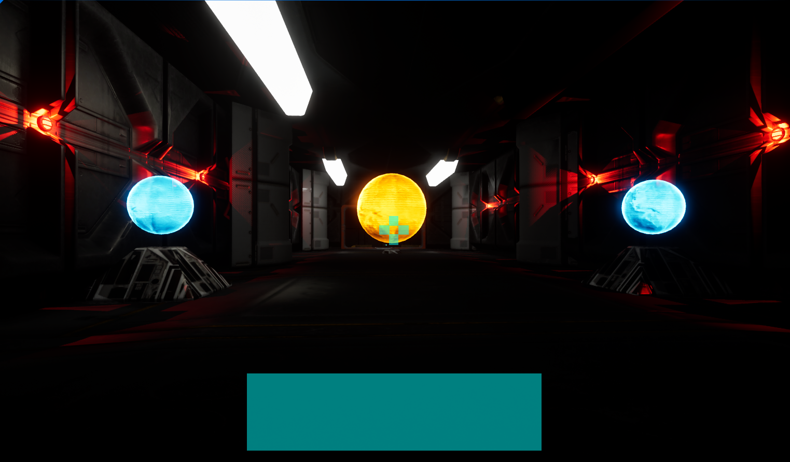
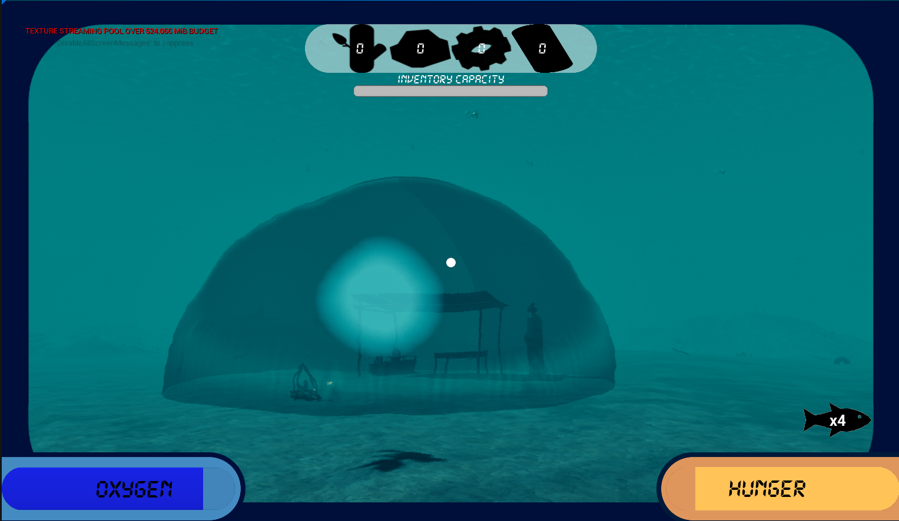
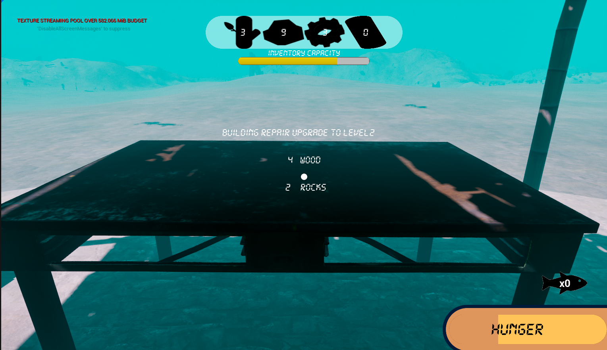
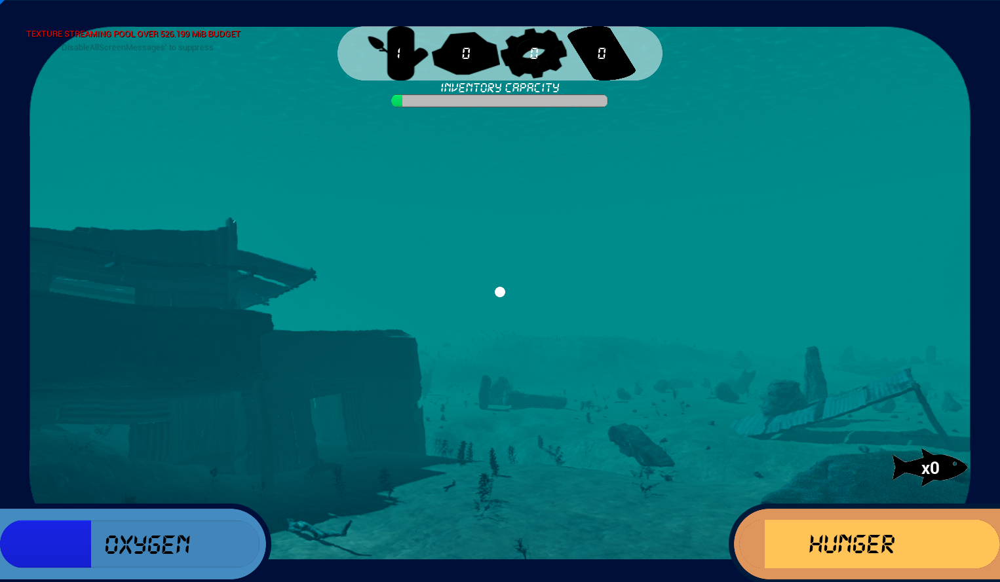

<html>
<head>
<header>Jake Allison Portfolio</header>
<link rel="stylesheet" href="https://raw.githubusercontent.com/JakeA2004/Game-Projects/refs/heads/main/style.css">  

</head>
<body>

Email: jakeallison8@hotmail.co.uk

LinkedIn:

Indeed:

  
<h1>Student at Northumbria University</h1>

Experienced in...

Java Programming

Unreal Engine 5 Blueprint Scripting 

GameMaker Language

HTML and Web Programming

<h1>Game Projects</h1>

My projects created for my university degree as well as my entry for Global Games Jam 2025

  
  
  

  

    
  

  

    
  

  

    
  

</body>
</html>

