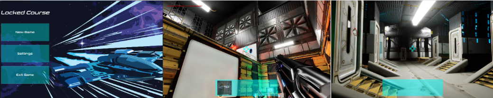
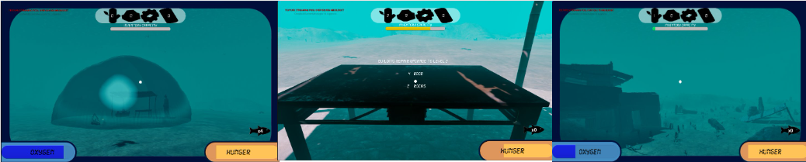
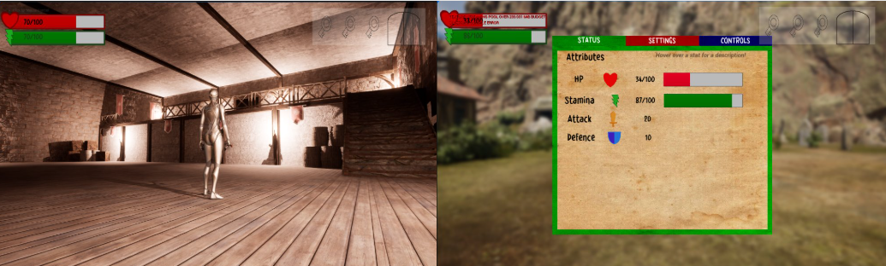

<html>
<head>
<header>Jake Allison Portfolio</header>
<link rel="stylesheet" href="https://raw.githubusercontent.com/JakeA2004/Game-Projects/refs/heads/main/style.css">  
</head>
<body>

Email: jakeallison8@hotmail.co.uk

LinkedIn:

Indeed:

  
<h1>Student at Northumbria University</h1>

Experienced in...

Java Programming

Unreal Engine 5 Blueprint Scripting 

GameMaker Language

HTML and Web Programming

<h1>Game Projects</h1>

My projects created for my university degree as well as my entry for Global Games Jam 2025

<h2> Locked Course</h2>

An puzzle-action game set in an alien spaceship. The player explores abandonned facilities, collecting weapons like the grappling hook and portal gun in order to find a way home. I took the role of Lead Designer for gameplay, levels and UI. Developed for Team Project and Professionalism module, collaborating with 5 other students. Engine Used: Unreal Engine 5 

AAAAAAA 

AAAAAAA 

</body>
</html>

